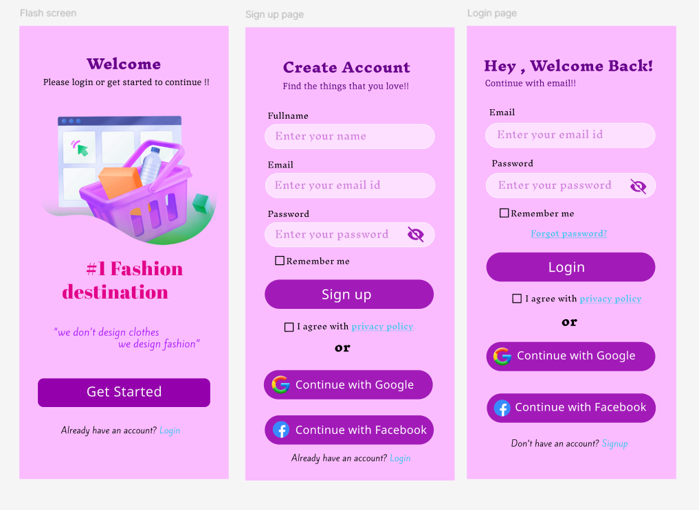

# 👗 Fashion Store Authentication UI

## 📖 Overview

This project is a beginner UI/UX design created while learning **Figma**. The objective was to design a modern authentication flow for a fashion shopping application that provides users with a clean and engaging onboarding experience.

The design consists of a splash screen, sign-up screen, and login screen, following a consistent visual theme with a vibrant purple color palette and rounded user interface components.

---

## 🎯 Design Objective

The primary goal of this design was to:

- Create an attractive onboarding experience
- Design intuitive authentication screens
- Maintain visual consistency
- Explore typography and spacing
- Improve user interaction through clean layouts

---

## 📱 Screens Included

| Screen | Description |
|---------|-------------|
| 🌸 Splash Screen | Welcome screen introducing the fashion application |
| 📝 Sign-Up Screen | User registration with email and password |
| 🔐 Login Screen | Existing user authentication with social login options |

---

## 🖼️ Design Preview

---

## 🎨 Design Style

- Modern UI
- Purple-inspired color palette
- Rounded buttons and input fields
- Minimalist layout
- Mobile-first interface

---

## 🛠️ Tools Used

- Figma

---

## ✨ Features

- Splash screen
- User Registration
- User Login
- Google Authentication Button
- Facebook Authentication Button
- Remember Me option
- Forgot Password
- Privacy Policy
- Clean mobile layout

---

## 📚 Learning Outcomes

This project helped me understand:

- Mobile UI design principles
- Typography hierarchy
- Color consistency
- Layout composition
- Form design
- Button styling
- Spacing and alignment
- Component reuse in Figma

---

## 🚀 Future Improvements

- Dark Mode
- OTP Verification
- Fingerprint Authentication
- Face ID Login
- Interactive animations
- Better accessibility support

---

## 📌 Project Status

✅ Completed as part of my UI/UX learning journey.