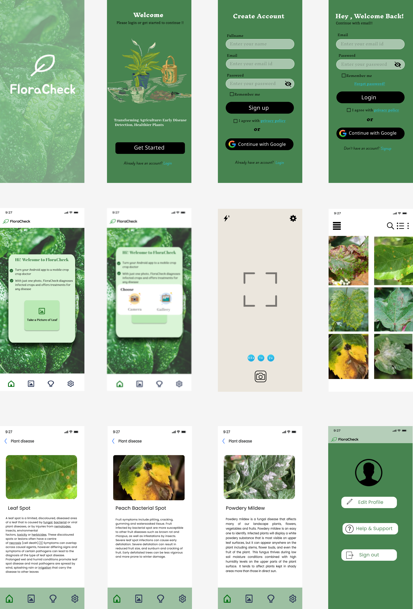

# 🌿 FloraCheck – Plant Disease Detection Mobile App

## 📖 Overview

**FloraCheck** is a mobile application UI/UX design created using **Figma** as part of my AI-powered plant disease detection project. The application was designed to provide farmers, gardeners, and agriculture enthusiasts with a simple and intuitive interface for identifying plant leaf diseases using image-based deep learning.

The design focuses on creating a seamless user experience by guiding users from authentication to disease prediction and preventive recommendations.

---

# 🎯 Design Objective

The primary objective of FloraCheck is to design a user-friendly mobile application that enables users to:

- Capture or upload plant leaf images
- Detect plant diseases using AI
- View disease information
- Learn preventive measures
- Navigate easily through the application

---

# 📱 Screens Included

| Screen | Description |
|---------|-------------|
| 🌿 Splash Screen | Application branding |
| 👋 Welcome Screen | Application introduction |
| 📝 Sign-Up | User registration |
| 🔐 Login | User authentication |
| 🏠 Home Dashboard | Upload leaf image |
| 📂 Image Selection | Camera or Gallery |
| 📷 Camera Screen | Capture leaf image |
| 🖼 Disease Gallery | Browse sample diseases |
| 🔍 Disease Details | Disease description and prevention |
| ⚙ Settings | User profile and preferences |

---

# 🖼️ Application Preview

---

# ✨ Features

- AI-powered Plant Disease Detection
- Camera Integration
- Gallery Upload
- Authentication Flow
- Disease Information
- Preventive Measures
- Image Gallery
- Profile Management
- Minimal Navigation
- Modern Mobile Interface

---

# 🎨 Design Style

- Nature-inspired green color palette
- Minimal user interface
- Large action buttons
- Rounded UI components
- Simple navigation
- Mobile-first design

---

# 🛠️ Tools Used

- Figma

---

# 🤖 Related AI Project

This UI was designed for the AI project:

**Plant Leaf Disease Identification and Classification Using Ensemble Learning and Mish as an Activation Function**

The application is intended to work with a deep learning model capable of identifying multiple plant leaf diseases and providing preventive recommendations.

---

# 📚 Learning Outcomes

This project helped me understand:

- End-to-end mobile application design
- User journey mapping
- Design consistency
- Component reuse
- Mobile navigation
- Information hierarchy
- Dashboard design
- Image-based application workflows
- Figma prototyping

---

# 🚀 Future Improvements

- Dark Mode
- Multi-language Support
- Real-time Camera Detection
- Offline Prediction
- Farmer Community Forum
- AI Chat Assistant
- Voice Assistance
- Cloud Synchronization

---

# 📌 Project Status

✅ Completed as part of my AI and UI/UX learning journey.