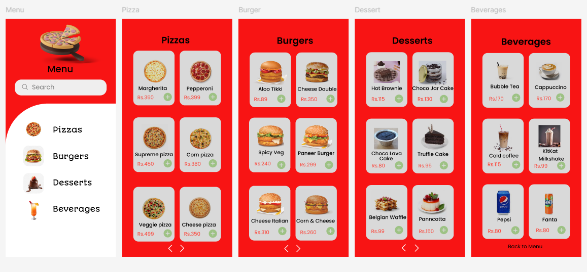

# 🍕 Food Ordering Menu UI

## 📖 Overview

This project is a beginner UI/UX design created while learning **Figma**. The objective was to design a simple and intuitive food ordering interface for a mobile application.

The design demonstrates category-based navigation, product cards, search functionality, and an organized menu layout that enables users to browse different food items quickly.

---

# 🎯 Design Objective

The primary objective of this project was to:

- Design an easy-to-use food ordering interface
- Organize menu items into categories
- Improve visual hierarchy
- Create reusable product cards
- Explore mobile-first UI principles

---

# 📱 Screens Included

| Screen | Description |
|---------|-------------|
| 🍽 Menu | Main navigation screen |
| 🍕 Pizza | Pizza category |
| 🍔 Burger | Burger category |
| 🍰 Dessert | Dessert category |
| 🥤 Beverages | Drinks category |

---

# 🖼️ Design Preview

---

# ✨ Features

- Search Bar
- Category Navigation
- Food Cards
- Product Images
- Pricing Display
- Add to Cart Button
- Multi-page Navigation
- Modern Card Layout

---

# 🎨 Design Style

- Bright color palette
- Minimal layout
- Rounded cards
- Category-based navigation
- Mobile-first design

---

# 🛠️ Tools Used

- Figma

---

# 📚 Learning Outcomes

This project helped me understand:

- Mobile application layouts
- Grid systems
- Card-based interfaces
- Navigation flow
- Component consistency
- Typography hierarchy
- Spacing and alignment
- UI organization

---

# 🚀 Future Improvements

- Shopping Cart
- Product Details Page
- Checkout Flow
- Favorites
- Search Suggestions
- Filters
- Dark Mode
- Responsive Tablet Layout

---

# 📌 Project Status

✅ Completed as part of my UI/UX learning journey.