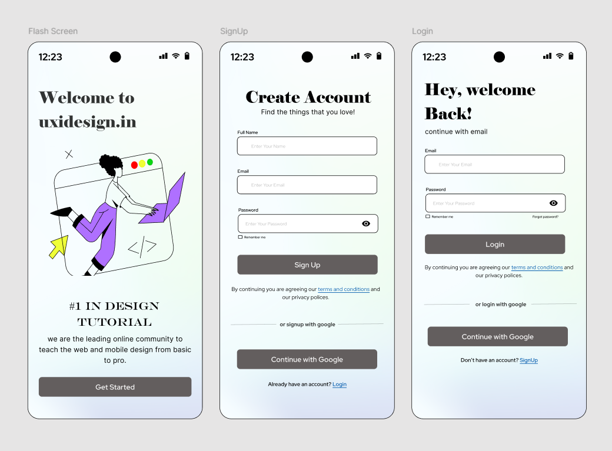

# 📱 Mobile App Sign-Up Flow

## Overview

This project is a beginner UI/UX design created while learning **Figma**. The objective was to design a simple and intuitive mobile authentication flow consisting of a splash screen, sign-up screen, and login screen.

The design focuses on creating a clean onboarding experience with minimal distractions while maintaining readability and consistency throughout the interface.

---

## 🎯 Design Goal

Design a user-friendly authentication flow that enables users to:

- View a welcoming splash screen
- Create a new account
- Log in to an existing account
- Continue using Google authentication

---

## 🖼️ Preview

---

## 📲 Screens Included

| Screen | Description |
|---------|-------------|
| Splash Screen | Introduction screen with branding and welcome message |
| Sign-Up Screen | New user registration form |
| Login Screen | Existing user authentication screen |

---

## 🎨 Design Style

- Minimal UI
- Soft gradient background
- Modern typography
- Simple form layouts
- Mobile-first design

---

## 🛠️ Tools Used

- Figma

---

## 📚 Learning Outcomes

During this project I learned:

- Mobile UI layout
- Auto Layout basics
- Typography hierarchy
- Spacing and alignment
- Form design
- Button consistency
- Color harmony

---

## 🚀 Future Improvements

- Dark Mode
- Password strength indicator
- OTP verification
- Social media login
- Accessibility improvements
- Micro interactions

---

## 📌 Status

✅ Completed as part of my UI/UX learning journey.