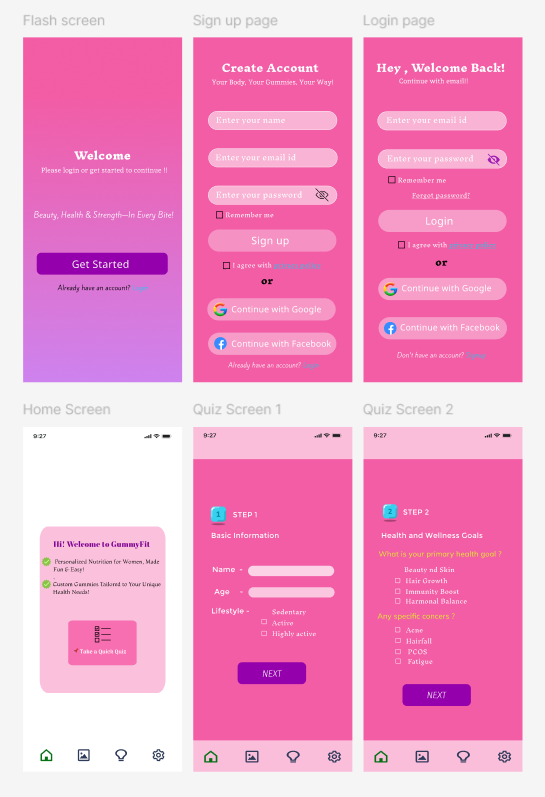

# 💊 Wellness Onboarding UI

## 📖 Overview

This project is a beginner UI/UX design created while learning **Figma**. The objective was to design a complete onboarding experience for a wellness application that guides users through account creation, authentication, and a personalized health assessment.

Unlike a traditional login interface, this design introduces a guided questionnaire to better understand user preferences before recommending personalized wellness products and services.

---

# 🎯 Design Objective

The goal of this project was to design an engaging onboarding experience that allows users to:

- Create an account
- Login securely
- Navigate through the application
- Complete a personalized wellness questionnaire
- Build a user-friendly mobile interface

---

# 📱 Screens Included

| Screen | Description |
|---------|-------------|
| 🚀 Splash Screen | Welcome screen introducing the application |
| 📝 Sign-Up | User registration |
| 🔐 Login | Existing user authentication |
| 🏠 Home | Dashboard with quiz entry |
| 📋 Quiz Step 1 | Basic Information |
| ❤️ Quiz Step 2 | Health Goals & Concerns |

---

# 🖼️ Design Preview

---

# ✨ Features

- Splash Screen
- User Authentication
- Home Dashboard
- Personalized Health Quiz
- Bottom Navigation
- Multi-Step Form
- Social Login
- Clean Mobile Interface

---

# 🎨 Design Style

- Modern mobile UI
- Wellness-inspired color palette
- Rounded interface components
- Minimal layout
- User-centered onboarding

---

# 🛠️ Tools Used

- Figma

---

# 📚 Learning Outcomes

During this project I learned:

- Designing complete user flows
- Multi-screen navigation
- Mobile UI hierarchy
- Form layouts
- Bottom navigation
- Quiz interface design
- Typography consistency
- Component reuse in Figma

---

# 🚀 Future Improvements

- Progress Indicator
- Interactive Prototype
- Dark Mode
- AI-based Recommendations
- User Profile
- Dashboard Analytics
- Accessibility Enhancements

---

# 📌 Project Status

✅ Completed as part of my UI/UX learning journey.